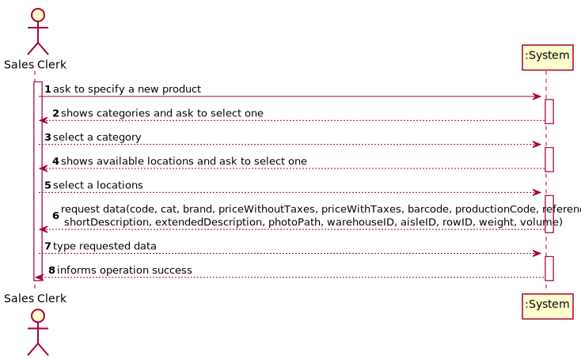
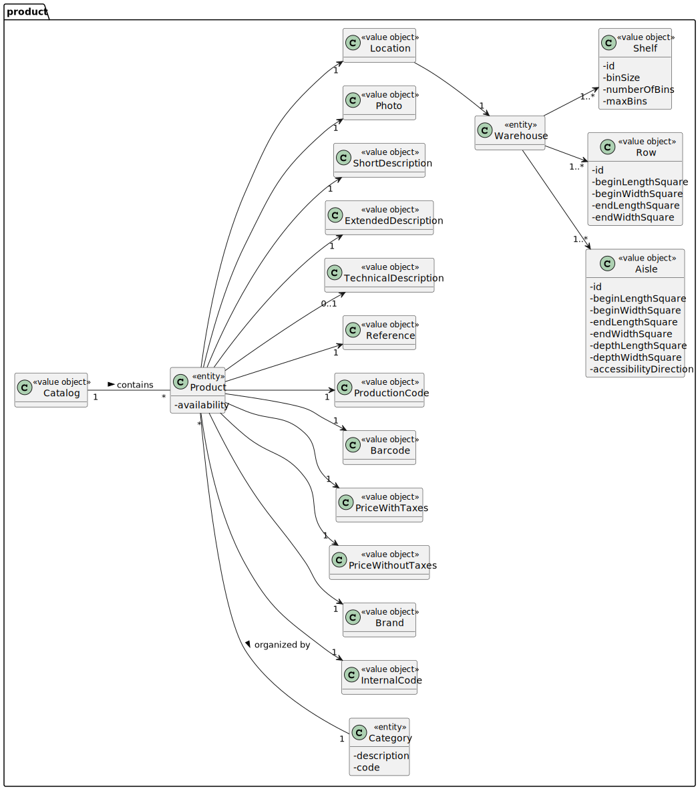
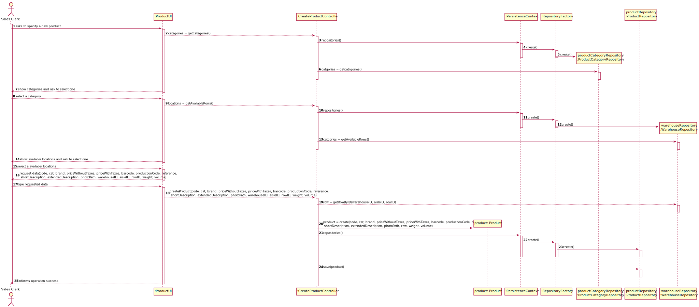
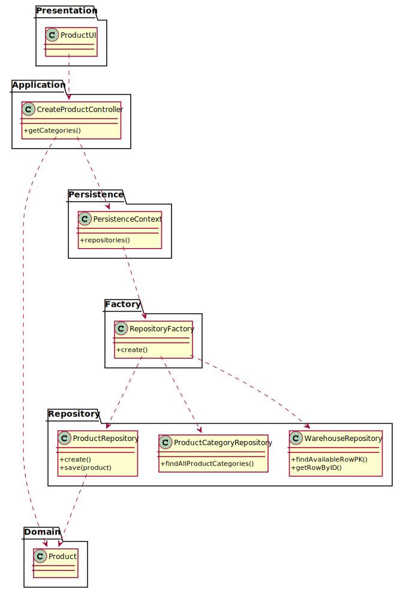

# US 1003 - As Sales Clerk, I want to register a new customer.

## 1. Requirements Engineering

### 1.1. User Story Description

As Sales Clerk, I want to specify a new product.

### 1.2. Customer Specifications and Clarifications

From the client clarifications:

* Question: "Can you clarify which attributes are mandatory and which ones are not?"
  * [Answer: ](https://moodle.isep.ipp.pt/mod/forum/discuss.php?d=16099#p20681) "When inquired about it, the team must support the decision made in light of the business needs."

* Question: "Given that all the units of a product are located in a single warehouse, should in the moment of creation of the product the sales clerk chose one of the available?"
  * [Answer: ](https://moodle.isep.ipp.pt/mod/forum/discuss.php?d=15970#p20501) "Yes, the product location might be specified during US 1001."

* Question: "Should we write the path to it, or should a window open to import the photo into the program?"
    * [Answer: ](https://moodle.isep.ipp.pt/mod/forum/discuss.php?d=15900#p20511) "From a usability perspective, it would be better having a window (or any other way) to select the photo file to be uploaded. However, if by some reason that option is not viable by now the user can write the path but the system must validate it."

* Question: "Are the internal code, production code and reference generated or entered?"
    * [Answer: ](https://moodle.isep.ipp.pt/mod/forum/discuss.php?d=15877#p20510) "That information is all entered/typed by the user."

* Question: "Regarding the barcode of a given product what should the coding standard be?"
    * [Answer: ](https://moodle.isep.ipp.pt/mod/forum/discuss.php?d=15753#p20256) "Any of the supported standards. It might be set by configuration at system implantation time."

* Question: "It was mentioned in a previous question that both the production code and the internal code have a set regular expression, could an example of said regular expressions be given?"
    * [Answer: ](https://moodle.isep.ipp.pt/mod/forum/discuss.php?d=15753#p20256) "For example, 4 letters followed by a dot (".") and ending with 5 digits."
    

### 1.3. Acceptance Criteria

### 1.4. Found out Dependencies

* The product category must already be created.

### 1.5 Input and Output Data

Input Data

* Typed data:

    * Code
    * Category
    * Brand
    * Price without taxes
    * Price with taxes
    * Barcode
    * Production code
    * Reference
    * Short description
    * Extended description
    * Photo
    * Location
    * Weight
    * Volume

Output Data

* (In)Success of the operation

### 1.6. System Sequence Diagram (SSD)

### 1.7 Other Relevant Remarks

## 2. Analysis

### 2.1. Relevant Domain Model Excerpt

### 2.2. Other Remarks

## 3. Design - User Story Realization

### 3.1. Sequence Diagram (SD)

## 3.2. Class Diagram (CD)

# 4. Tests

    @Test(expected = SizeLimitExceededException.class)
    public void extendedDescriptionRules() throws SizeLimitExceededException {
        Roww row = new Roww(1L, "Warehouse", 2L, 0,0,3,3, 10);
        ProductCategory pc1 = new ProductCategory("description1aaaadfsgehr", "1234");
        Product p = new Product("ab1234", pc1, "brand1", 30, 35, "123456782345", "cd1231", "12313", "short", "extended", "simulatePhoto", row, true, 30.0, 30.0);
    }

    @Test(expected = SizeLimitExceededException.class)
    public void extendedDescriptionRules2() throws SizeLimitExceededException {
        Roww row = new Roww(1L, "Warehouse", 2L, 0,0,3,3, 10);
        ProductCategory pc1 = new ProductCategory("description1aaaadfsgehr", "1234");
        Product p = new Product("ab1234", pc1, "brand1", 30, 35, "123456782345", "cd1231", "12313", "short", "extended1extended1extended1extended1extended1extended1extended1extended1extended1extended1extended1extended1", "simulatePhoto", row, true, 30.0, 30.0);
    }

    @Test(expected = SizeLimitExceededException.class)
    public void brandRules() throws SizeLimitExceededException {
        Roww row = new Roww(1L, "Warehouse", 2L, 0,0,3,3, 10);
        ProductCategory pc1 = new ProductCategory("description1aaaadfsgehr", "1234");
        Product p = new Product("ab1234", pc1, "brandbrandbrandbrandbrandbrandbrandbrandbrandbrandbrandbrand", 30, 35, "123456782345", "cd1231", "12313", "short", "extended description123", "simulatePhoto", row, true, 30.0, 30.0);
    }