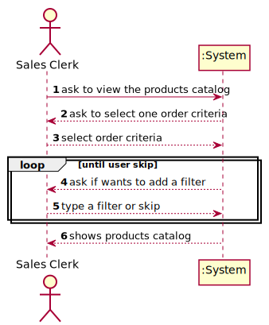
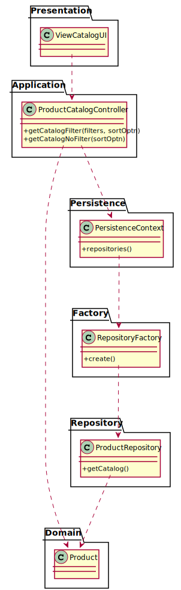

# US 1003 - As Sales Clerk, I want to register a new customer.

## 1. Requirements Engineering

### 1.1. User Story Description

As Sales Clerk, I want to view the product catalog.

### 1.2. Customer Specifications and Clarifications

From the client clarifications:

* Question: "In the us1002 we have 3 filters (category, brand and description) to search for products, but can the Sales Clerk only use a filter by search or can use the three?"
  * [Answer: ](https://moodle.isep.ipp.pt/mod/forum/discuss.php?d=16092#p20677) "Put yourself on the Sales Clerk shoes. Probably, you would figure out that sometimes you need to filter using just one attribute and on another case you need to apply/combine filtering criteria of two or more attributes."

* Question: "Regarding the product search, is there a field you want to use to filter the data and any desired data presentation order? And do you want to see all the fields or just a simplified summary?"
  * [Answer: ](https://moodle.isep.ipp.pt/mod/forum/discuss.php?d=15690#p20165) "Commonly fields used to filter products are: category, description and brand. At least the product' code, short description, brand, category and unit price should be presented."
  

### 1.3. Acceptance Criteria

### 1.4. Found out Dependencies

* The products must already be created.

### 1.5 Input and Output Data

Input Data

* Typed data:

    * Order method
    * Filters

Output Data

* Catalog

### 1.6. System Sequence Diagram (SSD)

### 1.7 Other Relevant Remarks

## 2. Analysis

### 2.1. Relevant Domain Model Excerpt

### 2.2. Other Remarks

## 3. Design - User Story Realization

### 3.1. Sequence Diagram (SD)

## 3.2. Class Diagram (CD)

