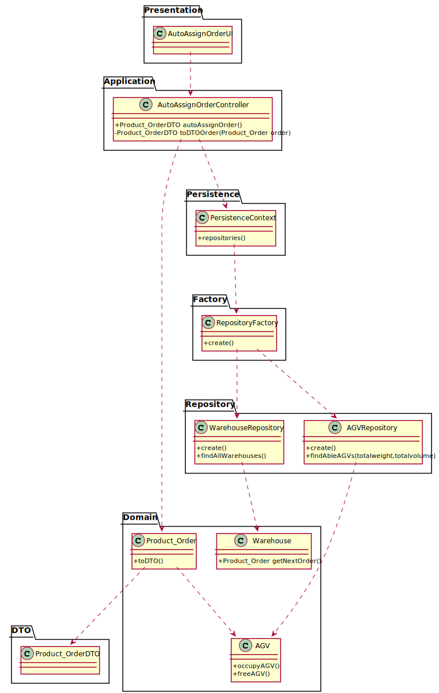

# US 4002 - As Project Manager, I want that the "AGVManager" component is enhanced with a basic FIFO algorithm to automatically assign tasks to AGVs.

## 1. Requirements Engineering

### 1.1. User Story Description

As Project Manager, I want that the "AGVManager" component is enhanced with a basic FIFO algorithm to automatically assign tasks to AGVs.

### 1.2. Customer Specifications and Clarifications

From the client clarifications:

* Question: "Will the FIFO algorithm be used to control the tasks/orders that are waiting for an available AGV?"
    * [Answer: ](https://moodle.isep.ipp.pt/mod/forum/discuss.php?d=16326#p21037) "The general idea is that product orders reaching a certain state whose meaning is of "need to be prepared by an AGV" are added to a queue. Then, following the FIFO algorithm orders are removed from the queue and assigned to available AGVs capable of performing the task that such order implies."

* Question: "Talking about being automatic, the System executes this functionally after some other functionality, or executes it periodically? If it is periodically, how often?"
    * [Answer: ](https://moodle.isep.ipp.pt/mod/forum/discuss.php?d=16326#p21037) "Teams are free to propose a solution for that problem/issue. Notice that all team decisions must be well supported in light of business need and technical constraints."

### 1.3. Acceptance Criteria

### 1.4. Found out Dependencies

* The product order is added to the queue when the order is created.

### 1.5 Input and Output Data

Input Data

* Selected data:

Output Data

* The order assigned
* (In)Success of the operation

### 1.6. System Sequence Diagram (SSD)

### 1.7 Other Relevant Remarks

* When the product order are created, it is added to the queue.
* When this option is selected, the first order added to the queue is selected and assigned to an AGV.
* I decided to add an option to assign the next order to an AGV, because if the AGV delivery location is busy, it makes no sense for the AGV to place another order, because otherwise, it would create confusion between orders.

## 2. Analysis

### 2.1. Relevant Domain Model Excerpt

### 2.2. Other Remarks

## 3. Design - User Story Realization

### 3.1. Sequence Diagram (SD)

## 3.2. Class Diagram (CD)

# 4. Tests

