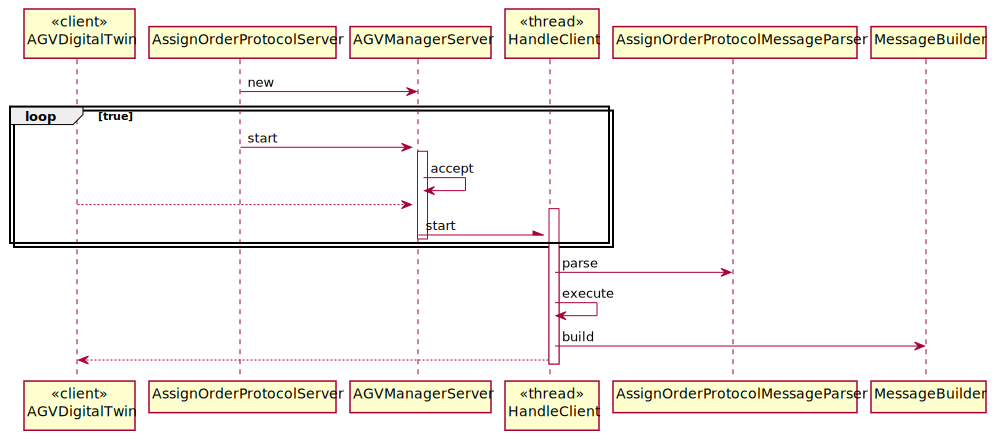
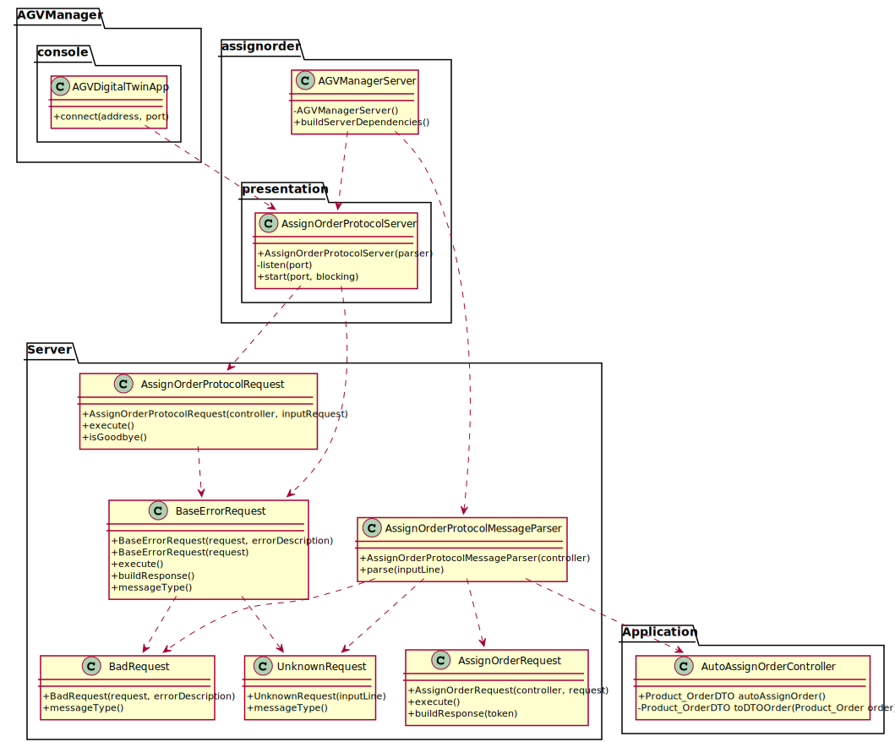

# US 5001 - As Project Manager, I want that the team start developing the input communication module of the AGV digital twin to accept requests from the "AGVManager".

## 1. Requirements Engineering

### 1.1. User Story Description

As Project Manager, I want that the team start developing the input communication module of the AGV digital twin to accept requests from the "AGVManager".

### 1.2. Customer Specifications and Clarifications

From the client clarifications:

* Question: "What type of communication do you want, i.e., what are the communications that you want to have between these two. Like AGV Manager says "Take a product" and AGV Digital Twin says "Taken"? Is it something like that? Or am i confused?"
    * [Answer: ](https://moodle.isep.ipp.pt/mod/forum/discuss.php?d=16593#p21297) "The communication must follow the SPOMS2022 protocol. It is up to you and your team to devise a set of messages fulfilling the business requirements properly."

* Question: "Regarding the USs 1901,4001, 5001, and 5002, what would you consider its complete state, that is, what would be the criterion to define whether or not this US is functional?"
    * [Answer: ](https://moodle.isep.ipp.pt/mod/forum/discuss.php?d=16437#p21107) "For all of those US, the communication between the two involved components must be implemented in accordance with the SPOMS2022. The requests processing can be somehow mocked. For instance, if processing a request implies saving some data to the database, the component can instead write such data to a log (mocking). Latter, on next sprint, the teams implement the interaction to the database."

### 1.3. Acceptance Criteria

* It must be used the provided application protocol (SPOMS2022).
* It is suggested the adoptiong of concurrent mechanisms (e.g. threads) and state sharing between these mechanisms.
* In this sprint, for demonstration purposes, it is acceptable to mock processing some of the incoming requests to foster some output communication.

### 1.4. Found out Dependencies

### 1.5 Input and Output Data

### 1.6 Other Relevant Remarks

## 2. Analysis

### 2.1. Relevant Domain Model Excerpt

### 2.2. Other Remarks

## 3. Design - User Story Realization

### 3.1. Sequence Diagram (SD)

## 3.2. Class Diagram (CD)

# 4. Tests

