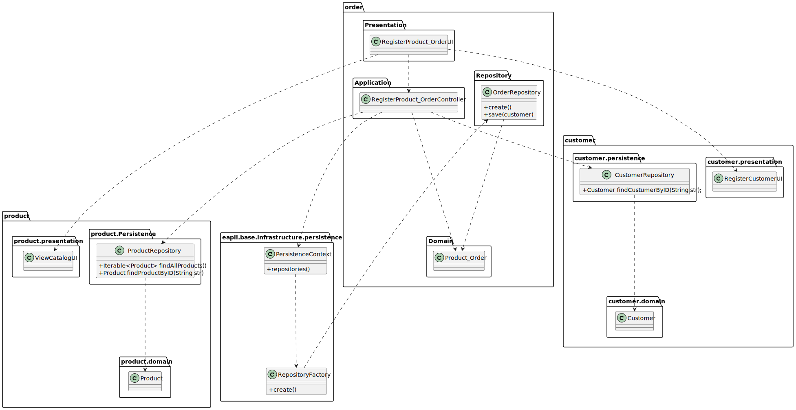

# US 1003 - As Sales Clerk, I want to register a new Order on behalf of a given customer.

## 1. Requirements Engineering

### 1.1. User Story Description

As Sales Clerk, I want to register a new Order on behalf of a given customer.

### 1.2. Customer Specifications and Clarifications

From the client clarifications:

* Question: "Dear client, Is it required that the system keep an history of the order state? For example, if an order changes from "payment pending" to "to be prepared", are we required to keep the date of this change for future query? Thank you. "
  * [Answer: ](https://moodle.isep.ipp.pt/mod/forum/discuss.php?d=15708) "Keeping order state history, as suggested, is an interesting feature that will be highly appreciated/valued."

* Question: "What are the parameters, i.e. what does a payment confirmation consist of?"
  * [Answer: ](https://moodle.isep.ipp.pt/mod/forum/discuss.php?d=15579) "It varies from one payment service to another. Generalising, consider it a text with 512 chars max."

* Question: "Regarding US1004 when a sales clerk creates a new order for a given customer, does the customer need to be registered in the system?"
    * [Answer: ](https://moodle.isep.ipp.pt/mod/forum/discuss.php?d=15962) "Most of the times, the customer is already registered.However, it might happen (s)he is not registered. In such case, the customer is registered on that moment using US1003."

* Question: "How will the customer pay for the order placed by the clerk. Will receive a notification?"
    * [Answer: ](https://moodle.isep.ipp.pt/mod/forum/discuss.php?d=15938) "For now, you may assume the clerk selects one of the available payment methods and types the required information. Yet, I would like to emphasise what is stated in the specifications document:"While developing the system prototype, these two issues (i.e.: shipment and payment) must be considered. Although, since both are not perceived as representing a risk to the project, the shipment cost computation, and the connections to external systems (e.g.: carriers and payment services) should be mock.""

* Question: "After placing the order will the system notify the customer? If so, how?"
    * [Answer: ](https://moodle.isep.ipp.pt/mod/forum/discuss.php?d=15938) "That is a good idea... the system might send a notification email to the customer. This functionality will be seen as an asset to distinguish the solutions presented by different development teams."

* Question: "How do you want the clerk to select the products? By putting their id or selecting?"
    * [Answer: ](https://moodle.isep.ipp.pt/mod/forum/discuss.php?d=15938) "Both: by typing the product id when knowing it or by using searching/browsing the products catalog (US1002)."

### 1.3. Acceptance Criteria

### 1.4. Found out Dependencies

### 1.5 Input and Output Data

Input Data

* Typed data:

    * source of information
    * quantity
    * customer ID
    * billing address
    * delivering address

* Selected data:
    * products
    * payment method
    * billing address
    * delivering address
    * shipment method

Output Data

* (In)Success of the operation

### 1.6. System Sequence Diagram (SSD)

### 1.7 Other Relevant Remarks

## 2. Analysis

### 2.1. Relevant Domain Model Excerpt

### 2.2. Other Remarks

## 3. Design - User Story Realization

### 3.1. Sequence Diagram (SD)

## 3.2. Class Diagram (CD)

# 4. Tests

