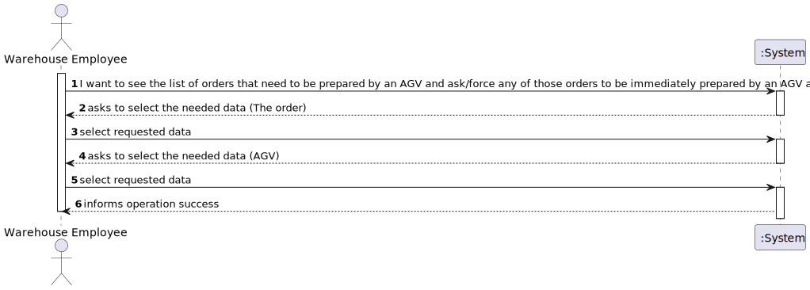
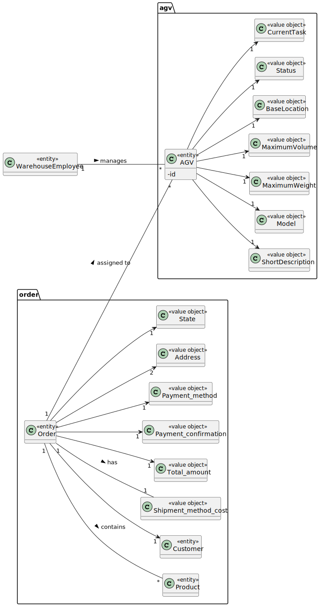
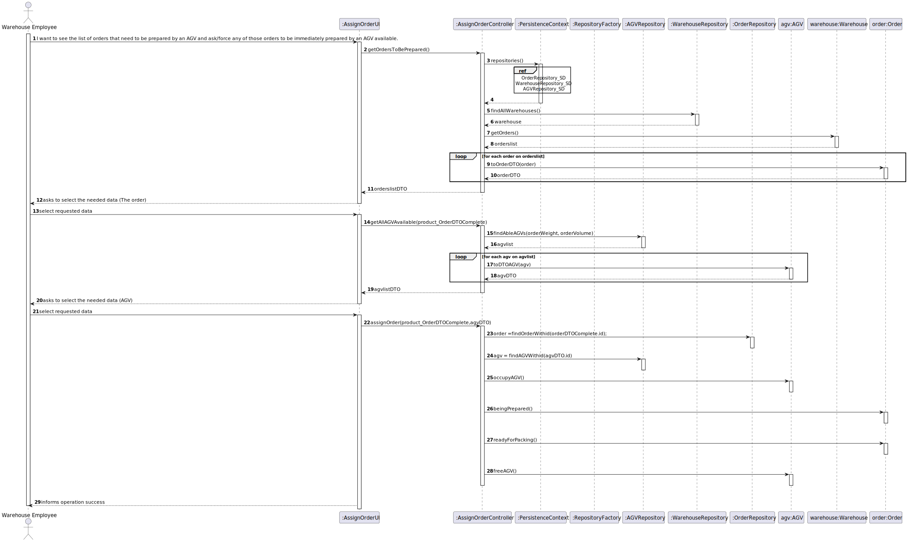
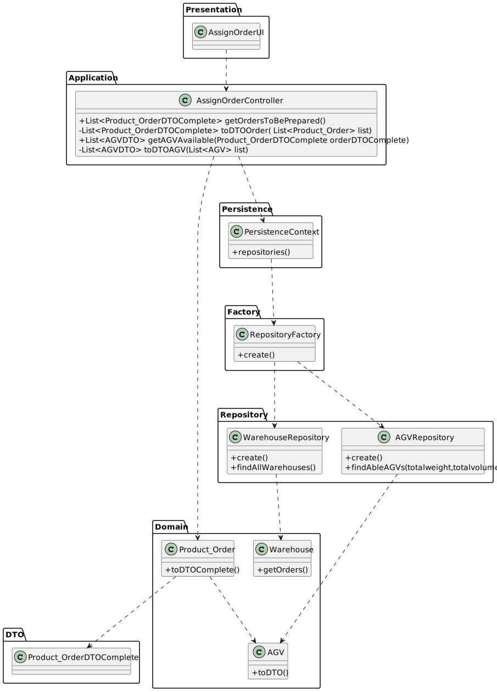

# US 2003 - As Warehouse Employee, I want to access the list of orders that need to be prepared by an AGV and be able to ask/force any of those orders to be immediately prepared by an AGV available.

## 1. Requirements Engineering

### 1.1. User Story Description

As Warehouse Employee, I want to access the list of orders that need to be prepared by an AGV and be able to ask/force any of those orders to be immediately prepared by an AGV available.

### 1.2. Customer Specifications and Clarifications

From the client clarifications:

* Question: "Regarding this feature, what would you consider to be its complete state, that is, what would be the criterion to define whether or not this feature was functional? "
  * [Answer: ](https://moodle.isep.ipp.pt/mod/forum/discuss.php?d=16290) "The warehouse employee is able to (i) select an order that needs to be prepared; (ii): select the AGV from the ones that are available and able to perform the task; (iii) the task is sent to the selected AGV and (iv) the order change its status."

* Question: "Knowing that in US2003 it is only mentioned that the Warehouse Employee will do this action, I would like to know if it is part of the System to allow users with greater skills and responsibilities (Warehouse Managers or Admins) to also perform the same task? If yes, which users?"
  * [Answer: ](https://moodle.isep.ipp.pt/mod/forum/discuss.php?d=16291) "No! There is not such need."

* Question: "What would be the minimum information needed to show the User in order to select the desired Order? From our meeting the minimum result was the Identification , total Weigth and Total Volume. Should we add something else?"
    * [Answer: ](https://moodle.isep.ipp.pt/mod/forum/discuss.php?d=16480) "I would say that from the warehouse employee point of view, it is useful to show the order id, the order date, the customer id/name and order total.The total weight and total volume might be also useful if (s)he knows the AGV' characteristics. However, it is up to the system ensure that the selected AGV is capable of fulfilling the task. "
    

### 1.3. Acceptance Criteria

### 1.4. Found out Dependencies

### 1.5 Input and Output Data

Input Data

* Typed data:

* Selected data:
    * An order 
    * An AGV

Output Data

* (In)Success of the operation

### 1.6. System Sequence Diagram (SSD)

### 1.7 Other Relevant Remarks

## 2. Analysis

### 2.1. Relevant Domain Model Excerpt

### 2.2. Other Remarks

## 3. Design - User Story Realization

### 3.1. Sequence Diagram (SD)

## 3.2. Class Diagram (CD)

# 4. Tests

