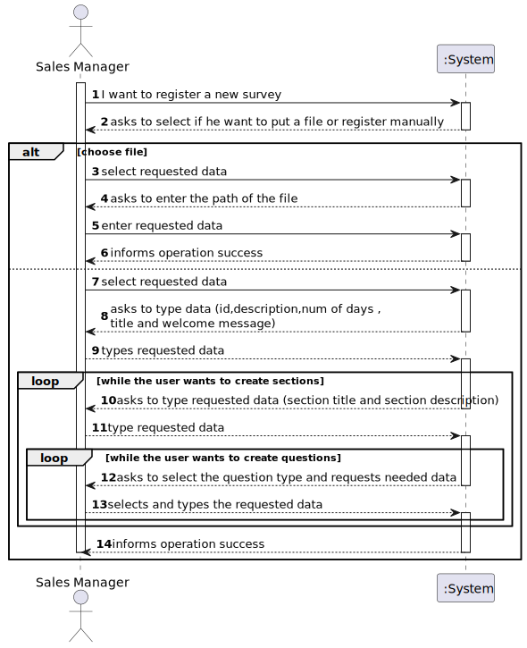
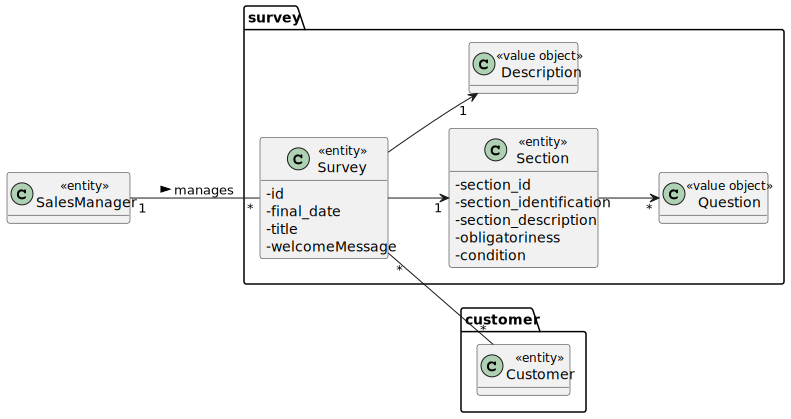
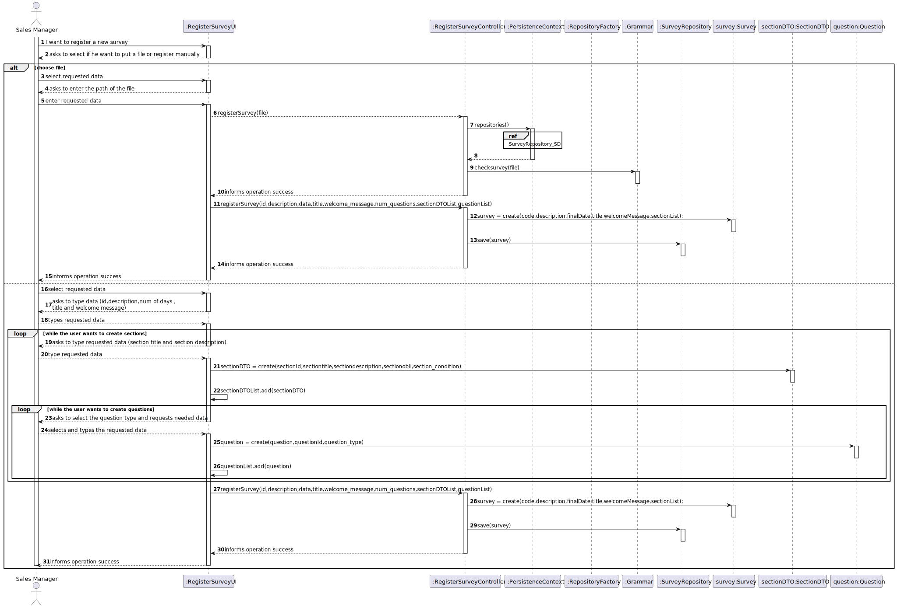
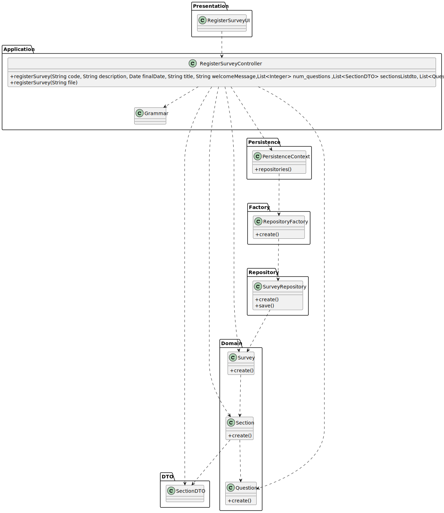

# US 3001 - As Sales Manager, I want to create a new questionnaire to be further answered by customers meeting the specified criteria (e.g.: have ordered a given product; belong to a given age group).

## 1. Requirements Engineering

### 1.1. User Story Description

As Sales Manager, I want to create a new questionnaire to be further answered by customers meeting the specified criteria (e.g.: have ordered a given product; belong to a given age group).

### 1.2. Customer Specifications and Clarifications

From the client clarifications:

* Question: "The User Story 3001  refers to the UC 3.3.1 -> "Create a new survey. A survey is characterized by an alphanumeric code, a description, the period( in days) it will be performed, the intended questionnaire, and a set of rules that allows the system to determine the survey target audience.But what are the constraints to the survey alphanumeric code and the description?  "
  * [Answer: ](https://moodle.isep.ipp.pt/mod/forum/discuss.php?d=16357) "- Code: alphanumeric value with 15 chars max;- Description: non-empty short sentence (e.g.: 40 chars)."

* Question: "Can you specify what you mean when a Question/Section is tagged with "condition dependent" and the type of conditions to be set."
  * [Answer: ](https://moodle.isep.ipp.pt/mod/forum/discuss.php?d=16388) "If the "obligatoriness" of a question/section is "condition dependent", it means it is "mandatory" when the associated condition evaluates as "true" and it is "optional" otherwise."

* Question: "When a Section has a Question tagged as "Mandatory" should the section become "Mandatory" as well?"
    * [Answer: ](https://moodle.isep.ipp.pt/mod/forum/discuss.php?d=16388) "The question/answer is not straightforward. However, some consistency/coherence must exist/be assured between the "obligatoriness" of the section and of the question. You must also assure consistency with the "repeatability" information of the section. A "mandatory" or "condition dependant" section does not imply any "obligatoriness" on the questions. An "optional" section implies that all questions are also "optional". If a question is "mandatory", it means the user needs to answer such question no matter what is stated at the section it appears on. If a question is "optional", it means that is up to the user to answer or not the question no matter what is stated at the section it appears on. If a question is "condition dependent", it means the system needs to evaluate the associated condition to determine how to proceed, i.e. as "mandatory" or as "optional" question."
    

### 1.3. Acceptance Criteria

The set of questions/answers composing the questionnaire should be expressed and validated (parsed) using the grammar being developed for this purpose.

### 1.4. Found out Dependencies

### 1.5 Input and Output Data

Input Data

* Typed data:
    * Survey Id
    * Survey description
    * The number of days the survey will be performed
    * The title of the survey
    * The welcome message
    * The section title
    * The section description
    * the question

* Selected data:
    * The question type 
    * The obligatoriness 

Output Data

* (In)Success of the operation

### 1.6. System Sequence Diagram (SSD)

### 1.7 Other Relevant Remarks

## 2. Analysis

### 2.1. Relevant Domain Model Excerpt

### 2.2. Other Remarks

## 3. Design - User Story Realization

### 3.1. Sequence Diagram (SD)

## 3.2. Class Diagram (CD)

# 4. Tests

