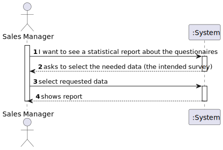
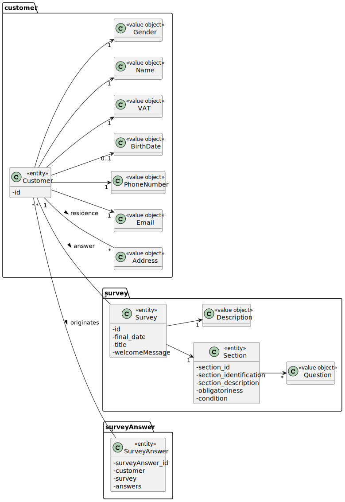
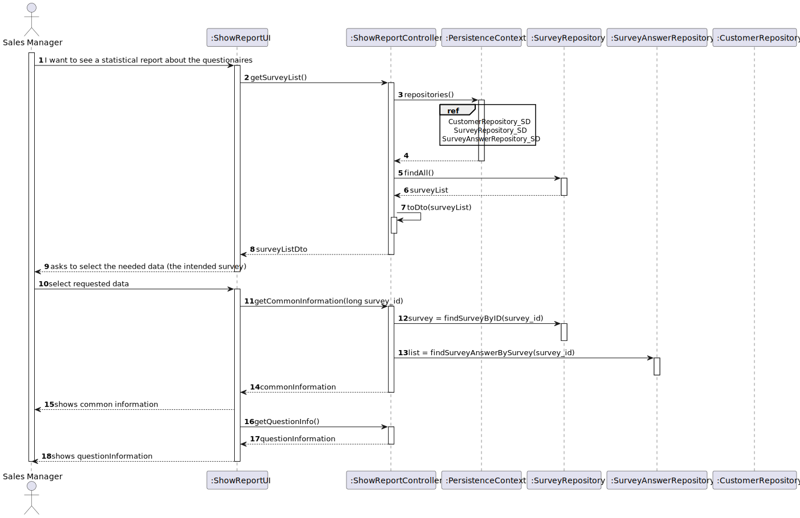
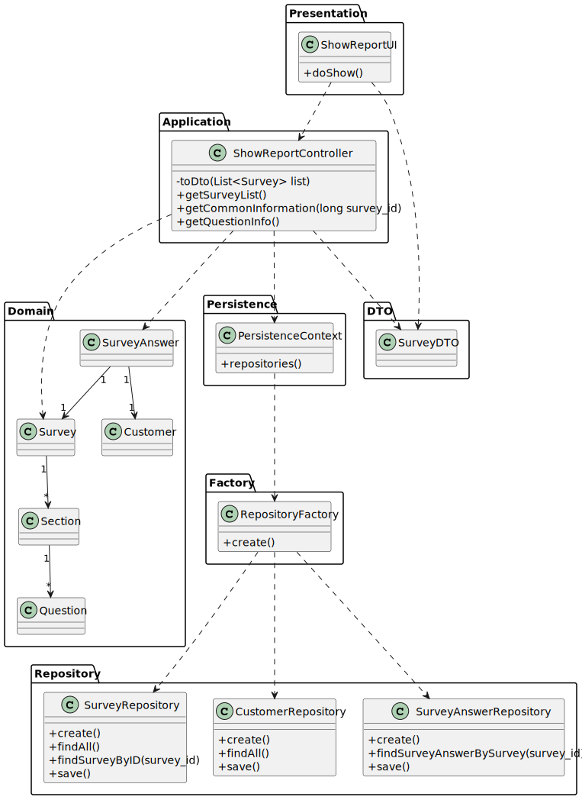

# US 3002 - As Sales Manager, I want to get a statistical report regarding a previously set up questionnaire.

## 1. Requirements Engineering

### 1.1. User Story Description

As Sales Manager, I want to get a statistical report regarding a previously set up questionnaire.

### 1.2. Customer Specifications and Clarifications

From the client clarifications:

* Question: "For this US, does the statistical report need to be shown to the SalesClerk or needs to be saved in some file too (p.e. text file)?"
  * [Answer: ](https://moodle.isep.ipp.pt/mod/forum/discuss.php?d=16836) "The important is to show the statistical report. Saving the report is not seen as relevant since, at any time, the user might request to see the report again. Notice that the information on which the report is computed is already persisted on the system."

* Question: "For this US, what are the types of statistical report that Sales Clerk want to see?"
  * [Answer: ](https://moodle.isep.ipp.pt/mod/forum/discuss.php?d=16825) "Any report must have the basic:— Universe Size (implies knowing the amount of users the survey was distributed to); — Number of Responses Obtained — % of responses obtained; Further, something depending on the question type:- For “Single-Choice” questions:— Distribution (in %) of responses for each alternative (e.g.: A = 30%, B = 27%, C = 40%, Others = 3%)- For “Multiple-Choice” questions:— Distribution (in %) of responses for each alternative (e.g.: A = 30%, B = 27%, C = 40%, Others = 3%)— Distribution (in %) of combined responses (e.g.: A+B = 15%, A+C = 100%, B+C=100%, A+B+C=10%)- For “Sorting-Options” questions:— Distribution of the various hypotheses for each position (e.g.: 1st Place = A(40%) B (60%) C(0%); 2nd Place = A(50%) B(40%) C(10%); 3rd Place =A(10%) C(90%))- For “Scaling-Options” questions:— Distribution of each option by scale levels.
  

### 1.3. Acceptance Criteria

Again, notice that the report should be generated considering the given questionnaire and the set of answers obtained until the current moment.

### 1.4. Found out Dependencies

It is necessary that there are answers to the questionnaire so that the report is not empty

### 1.5 Input and Output Data

Input Data

Output Data

* (In)Success of the operation
* The report

### 1.6. System Sequence Diagram (SSD)

### 1.7 Other Relevant Remarks

## 2. Analysis

### 2.1. Relevant Domain Model Excerpt

### 2.2. Other Remarks

## 3. Design - User Story Realization

### 3.1. Sequence Diagram (SD)

## 3.2. Class Diagram (CD)

# 4. Observation
This User Story was only show a report about the answer for a specific survey.
It was completed with no major issues.With the addition of the User Story no test were added because the domain classes still remains untouched.
In this functionality , the user will only select the survey he wants and a report will be shown.