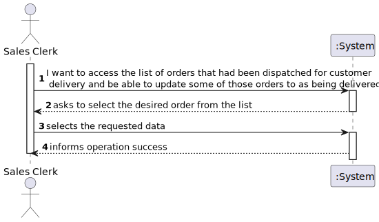
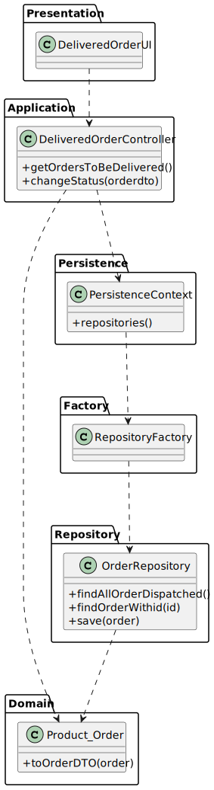

# US 1006 - As Sales Clerk, I want to access a list of orders that had been dispatched for customer delivery and be able to update some of those orders to as being delivered.
## 1. Requirements Engineering

### 1.1. User Story Description

As Sales Clerk, I want to access a list of orders that had been dispatched for customer delivery and be able to update some of those orders to as being delivered.

### 1.2. Customer Specifications and Clarifications

From the client clarifications:

None were necessary.

### 1.3. Acceptance Criteria

### 1.4. Found out Dependencies

* A order with the state dispatched must be created for this US to be of use.

### 1.5 Input and Output Data

Input Data

* Typed data:

* Selected data:
    * An order

Output Data

* (In)Success of the operation

### 1.6. System Sequence Diagram (SSD)

## 2. Analysis

### 2.1. Relevant Domain Model Excerpt

## 3. Design - User Story Realization

### 3.1. Sequence Diagram (SD)

## 3.2. Class Diagram (CD)

## 4. Observations

This User Story was straight foward and because of its similarities with US 2004 it was completed
with no problems. With the addition of the User Story no test were added because the domain classes still remains
untouched.

