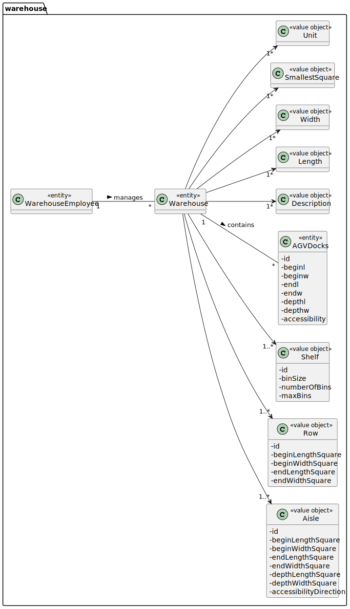

# US 2001 - As Warehouse Employee, I want to set up the warehouse plant by uploading a JSON file.

## 1. Requirements Engineering

### 1.1. User Story Description

As Warehouse Employee, I want to set up the warehouse plant by uploading a JSON file.

### 1.2. Customer Specifications and Clarifications

From the client clarifications:

* Question: "Regarding the shelves in each row that are part of an aisle, is there a need to differentiate them? If not, how will the AGV know on which shelf to look for a product? Because, as we understood, different products can be placed on a different shelf of the same row, and according to the JSON file provided, each row only states how many shelves it has."
  * [Answer: ](https://moodle.isep.ipp.pt/mod/forum/discuss.php?d=15758#p20257) "Yes! You need to differentiate the shelves in each row of an aisle."

* Question: "Regarding US2001, should the warehouse employee select from a list the warehouse he wants to set up the plant or should he type, for example, the id of the warehouse he wants to set up the plant?"
  * [Answer: ](https://moodle.isep.ipp.pt/mod/forum/discuss.php?d=15995#p20587) "Within this prototype, for the sake of simplicity, there is only 1 (one) warehouse."

### 1.3. Acceptance Criteria

* Remark: a pre-defined JSON file can be automatically upload (e.g. at application start-up) to get a default warehouse plant and avoiding the employee to execute this

### 1.4. Found out Dependencies

### 1.5 Input and Output Data

Input Data

* Typed data:

    * filename

Output Data

### 1.6. System Sequence Diagram (SSD)

## 2. Analysis

### 2.1. Relevant Domain Model Excerpt

## 3. Design - User Story Realization

### 3.1. Sequence Diagram (SD)

## 3.2. Class Diagram (CD)

# 4. Tests

    @Test
    public void setaddAgvDocks() throws SizeLimitExceededException {
        Aisle aisle = new Aisle();
        Set<Aisle> aisles = new HashSet<>();
        aisles.add(aisle);
        AGVDocks agvDocks = new AGVDocks();
        ShortDescription shortDescription = new ShortDescription("description");
        Model model= new Model("agvmodel");
        MaximumWeight maximumWeight = new MaximumWeight(12);
        MaximumVolume maximumVolume = new MaximumVolume(12);
        BaseLocation baseLocation = new BaseLocation("AGV dock");
        Status autonomy = new Status("Free");
        CurrentTask currentTask = new CurrentTask("None");
        List<AGVDocks> agvDocksList = new ArrayList<>();
        agvDocksList.add(agvDocks);
        AGV agv = new AGV("id1234",shortDescription,model,maximumWeight,maximumVolume,baseLocation,autonomy,currentTask);
        Warehouse warehouse = new Warehouse("",12,12,12,"",aisles,agvDocksList);
        agvDocks.setAgv(agv);
        warehouse.setaddAgvDocks(agvDocks);
        Assertions.assertEquals(warehouse.getAgvDocks(),agvDocksList);
    }

    @Test
    public void testToString() {
        Aisle aisle = new Aisle();
        Set<Aisle> aisles = new HashSet<>();
        AGVDocks agvDocks = new AGVDocks();
        List<AGVDocks> agvDocksList = new ArrayList<>();
        agvDocksList.add(agvDocks);
        Warehouse warehouse = new Warehouse("",12,12,12,"",aisles,agvDocksList);
        String tostring = "Warehouse{warehouse='', length=12, width=12, square=12, unit='', aisle=[]}";
        Assertions.assertEquals(warehouse.toString(),tostring);
    }

