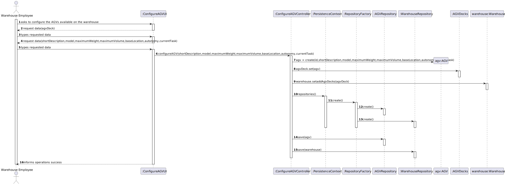

# US 2002 - As Warehouse Employee, I want to configure the AGVs available on the warehouse.

## 1. Requirements Engineering

### 1.1. User Story Description

As Warehouse Employee, I want to configure the AGVs available on the warehouse.

### 1.2. Customer Specifications and Clarifications

From the client clarifications:

* Question: "What position should be defined when configuring an AGV? The same position as his AGV Dock?"
  * [Answer: ](https://moodle.isep.ipp.pt/mod/forum/discuss.php?d=16096#p20678) "By default, the AGV is on its base location, i.e., on the AGV dock."

* Question: "should the id be generated automatically?
when we want to configure an agv, should we ask for a list of available agv where we will choose one or will it (automatically) be given one that is available?
how many agvs can the base location of wharehouse have?
when we want to set the agv, does this mean we will create one or will we redefine one that exists and is available (without any task)?
should the weight, volume, model and capacity of the agv be constant?"
  * [Answer: ](https://moodle.isep.ipp.pt/mod/forum/discuss.php?d=15988#p20584)Here are the answers to your questions:

  should the id be generated automatically?

  No!

  when we want to configure an agv, should we ask for a list of available agv where we will choose one or will it (automatically) be given one that is available?

  There is no list of AGV to choose from. The user specifies the AGV that exist in the warehouse. So, the user is creating the list of AGVs.

  how many agvs can the base location of wharehouse have?

  As said before, 1 AGV per dock.

  when we want to set the agv, does this mean we will create one or will we redefine one that exists and is available (without any task)?

  I do not understand this question in the scope of US 2002.

  should the weight, volume, model and capacity of the agv be constant?

  Such information varies from one AGV to another. Otherwise, it would not make any sense."

* Question: "There is a need to each AVG has its own avg dock? If it does makes sence to give him a responsible avg?"
  * [Answer: ](https://moodle.isep.ipp.pt/mod/forum/discuss.php?d=15824#p20359) "Every AGV has a base location, i.e.  an AGV dock. The same AGV dock can not be used by two (or more) distinct AGVs."

### 1.3. Acceptance Criteria

### 1.4. Found out Dependencies

* A AGV dock must exist to configure a AGV.

### 1.5 Input and Output Data

Input Data

* Typed data:

    * AGVDock
    * Id
    * Short Description
    * Model
    * Maximum Weight
    * Maximum Volume
    * Base Location
    * Status
    * Current Task

Output Data

### 1.6. System Sequence Diagram (SSD)

## 2. Analysis

### 2.1. Relevant Domain Model Excerpt

## 3. Design - User Story Realization

### 3.1. Sequence Diagram (SD)

## 3.2. Class Diagram (CD)

# 4. Tests

    @Test(expected = SizeLimitExceededException.class)
    public void id() throws SizeLimitExceededException {
        ShortDescription shortDescription = new ShortDescription("description");
        Model model= new Model("agvmodel");
        MaximumWeight maximumWeight = new MaximumWeight(12);
        MaximumVolume maximumVolume = new MaximumVolume(12);
        BaseLocation baseLocation = new BaseLocation("AGV dock");
        Status autonomy = new Status("Free");
        CurrentTask currentTask = new CurrentTask("None");
        AGV agv = new AGV("id12345672535",shortDescription,model,maximumWeight,maximumVolume,baseLocation,autonomy,currentTask);
    }

    @Test(expected = SizeLimitExceededException.class)
    public void shortDescription() throws SizeLimitExceededException {
        ShortDescription shortDescription = new ShortDescription("descriptionwegfwegwegewgegwewgewgegwegwegegwgewewgewgegwweggew");
        Model model= new Model("agvmodel");
        MaximumWeight maximumWeight = new MaximumWeight(12);
        MaximumVolume maximumVolume = new MaximumVolume(12);
        BaseLocation baseLocation = new BaseLocation("AGV dock");
        Status autonomy = new Status("Free");
        CurrentTask currentTask = new CurrentTask("None");
        new AGV("id12345",shortDescription,model,maximumWeight,maximumVolume,baseLocation,autonomy,currentTask);
    }

    @Test(expected = SizeLimitExceededException.class)
    public void model() throws SizeLimitExceededException {
        ShortDescription shortDescription = new ShortDescription("description");
        Model model= new Model("descriptionwegfwegwegewgegwewgewgegwegwegegwgewewgewgegwweggew");
        MaximumWeight maximumWeight = new MaximumWeight(12);
        MaximumVolume maximumVolume = new MaximumVolume(12);
        BaseLocation baseLocation = new BaseLocation("AGV dock");
        Status autonomy = new Status("Free");
        CurrentTask currentTask = new CurrentTask("None");
        new AGV("id12345",shortDescription,model,maximumWeight,maximumVolume,baseLocation,autonomy,currentTask);
    }