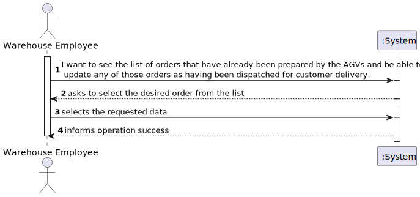
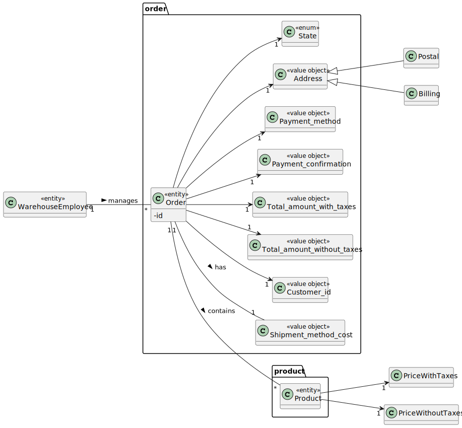
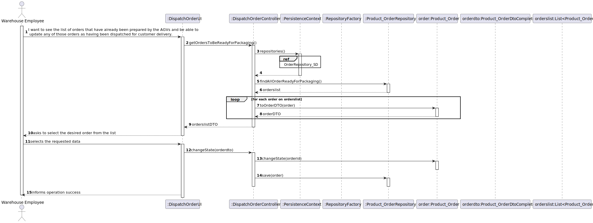
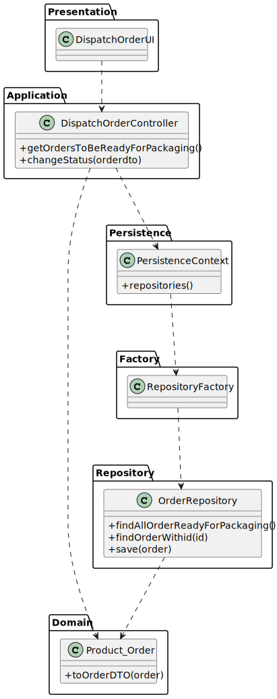

# US 2004 - As Warehouse Employee, I want to access the list of orders that have already been prepared by the AGVs and be able to update any of those orders as having been dispatched for customer delivery.

## 1. Requirements Engineering

### 1.1. User Story Description

As Warehouse Employee, I want to access the list of orders that have already been prepared by the AGVs and be able to update any of those orders as having been dispatched for customer delivery.

### 1.2. Customer Specifications and Clarifications

From the client clarifications:

* Question: "Regarding this feature, what would you consider to be its complete state, that is, what would be the criterion to define whether or not this feature was functional?"
  * [Answer: ](https://moodle.isep.ipp.pt/mod/forum/discuss.php?d=16330#p21039) "it seems the criteria you are looking for is somehow obvious: the status of the selected order(s) changed from "already been prepared by the AGV" to "dispatched for customer delivery"."

### 1.3. Acceptance Criteria

### 1.4. Found out Dependencies

* A order with the state ready for packing must be created for this US to be of use.

### 1.5 Input and Output Data

Input Data

* Typed data:

* Selected data:
    * An order

Output Data

* (In)Success of the operation

### 1.6. System Sequence Diagram (SSD)

## 2. Analysis

### 2.1. Relevant Domain Model Excerpt

## 3. Design - User Story Realization

### 3.1. Sequence Diagram (SD)

## 3.2. Class Diagram (CD)

