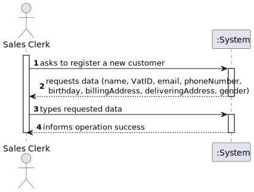
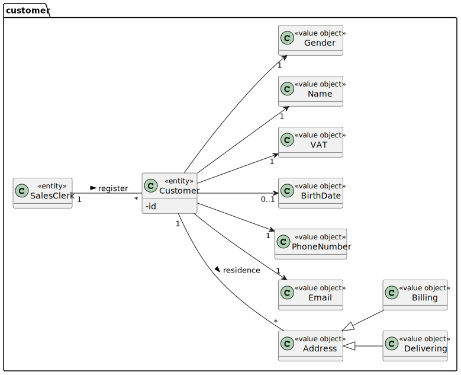
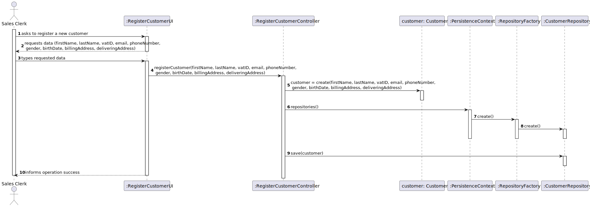
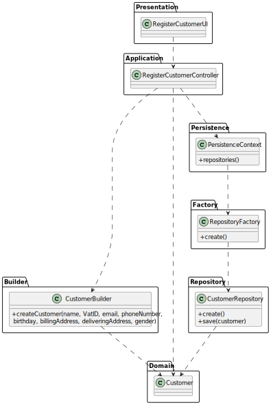

# US 1003 - As Sales Clerk, I want to register a new customer.

## 1. Requirements Engineering

### 1.1. User Story Description

As Sales Clerk, I want to register a new customer.

### 1.2. Customer Specifications and Clarifications

From the client clarifications:

* Question: "Name - should we consider first name, last name or is there anything more worth capturing? Are there length restrictions?"
  * [Answer: ](https://moodle.isep.ipp.pt/mod/forum/discuss.php?d=15754#p20248) "Name: at least a first and last name is required. Although, desirably the customer should specify his/her full name. Considering this, apply the min/max length you consider as reasonable to meet this requirement."

* Question: "VAT id- which length should it have? Is it only digits or could there be letters?"
  * [Answer: ](https://moodle.isep.ipp.pt/mod/forum/discuss.php?d=15754#p20248) "VAT ID varies from one country to another. Usually it has letters and numbers (cf. here). The system must be prepared to support/recognize several VAT Ids."

* Question: "Phone number: which lenght/format?"
    * [Answer: ](https://moodle.isep.ipp.pt/mod/forum/discuss.php?d=15754#p20248) "Phone number: according to international standards (e.g.: +351 934 563 123)."

* Question: "Birthday - in which format?"
    * [Answer: ](https://moodle.isep.ipp.pt/mod/forum/discuss.php?d=15754#p20248) "Birthday: it is a date... you can adopt year/month/day."

* Question: "Address - What kind of format are we expecting for these? Street name, door number, postal code, city, country is a valid format or are we missing anything?"
    * [Answer: ](https://moodle.isep.ipp.pt/mod/forum/discuss.php?d=15754#p20248) "Address: I think you said it all."

* Question: "When creating a customer, should it be automatically associated with a login, that is, when entering its data, such as name, and so it is necessary to enter a username and a password?"
    * [Answer: ](https://moodle.isep.ipp.pt/mod/forum/discuss.php?d=15749#p20243) "The customer is registering him/herself in the system (cf. Use Case 3.1.4a). In this scenario, credentials are generated as soon as the account activation process is successfully completed."

* Question: "However then it also says this: "Create credential for a customer. At any time, clerks might request the system to generate access credentials to a given customer access the system. The generated credentials are sent by email to the customer and are never shown to the clerk." Should these features be implemented together?"
    * [Answer: ](https://moodle.isep.ipp.pt/mod/forum/discuss.php?d=15749#p20243) "A clerk is registering customers either manually or by importing files (cf. Use Case 3.1.4b and 3.1.4c respectively). In this scenario no account activation process is required and/or performed. Moreover, by default, no customer credentials are to be generated. If such credentials are needed, the clerk undergoes on another use case (cf. Use Case 3.1.5)."

* Question: "Does the customer (client) need to have an address when creating? Or initially this field may be empty and only need address when it requests a purchase."
    * [Answer: ](https://moodle.isep.ipp.pt/mod/forum/discuss.php?d=15579#p20035) "Regarding customers, the minimum required information is its name, a valid Value-Added Tax (VAT) identifier, an email address, and a phone number."

### 1.3. Acceptance Criteria

### 1.4. Found out Dependencies

### 1.5 Input and Output Data

Input Data

* Typed data:

    * name
    * VAT id
    * email
    * phone number
    * birthday
    * billing address
    * delivering address
    * gender

Output Data

* (In)Success of the operation

### 1.6. System Sequence Diagram (SSD)

### 1.7 Other Relevant Remarks

## 2. Analysis

### 2.1. Relevant Domain Model Excerpt

### 2.2. Other Remarks

## 3. Design - User Story Realization

### 3.1. Sequence Diagram (SD)

## 3.2. Class Diagram (CD)

# 4. Tests

**Test 1:**

    @Test
    public void getDeliveringAddress() {
        List<String> billingAddress=new ArrayList<>();
        billingAddress.add("Rua 1 n4 4567-789");
        List<String> deliveringAddress=new ArrayList<>();
        deliveringAddress.add("Rua 3 n78 4523-439");
        Customer customer = new Customer("Joana", "PT123456789","joana@email.com","+351916245321","female","24/09/2000",billingAddress,deliveringAddress);
        List<Address> expected = new ArrayList<>();
        expected.add(new Address("Rua 3 n78 4523-439"));
        List<Address> result = customer.getDeliveringAddress();
        Assert.assertEquals(expected.get(0).toString(),result.get(0).toString());
    }