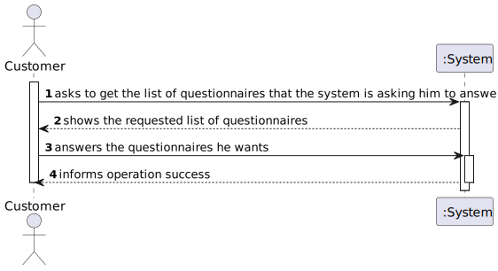
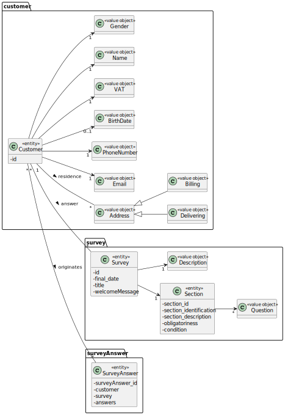
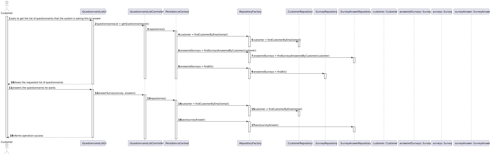
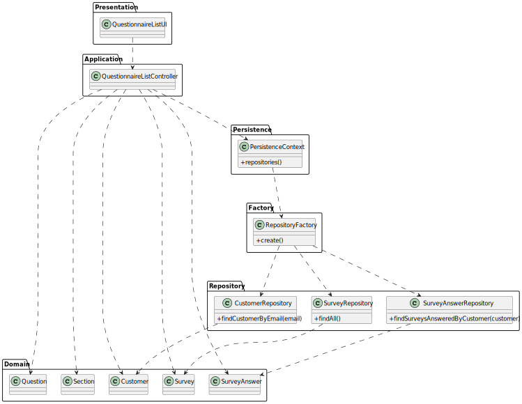

# US 3501 - As Customer, I want to get the list of questionnaires that the system is asking me to answer and be able to answer any of those questionnaires.

## 1. Requirements Engineering

### 1.1. User Story Description

As Customer, I want to get the list of questionnaires that the system is asking me to answer and be able to answer any of those questionnaires.

### 1.2. Customer Specifications and Clarifications

From the client clarifications:

* Question: "The defined architecture for the product indicates that requests from the Customer App to the Database must go through the Orders Server. As such, I was wondering if the same applies when the Customer App needs the Surveys to show to the customers, that is, if the Customer App can or not directly communicate with the Database to request the surveys or if the surveys need to come from the Orders Server. I assume that it is the second option, but just to make sure."
    * [Answer: ](https://moodle.isep.ipp.pt/mod/forum/discuss.php?d=17075#p21890) "The specifications' document states (page 10): A direct connection to the database (graphically depicted on red) must be avoid. Instead, data requests should be made through the “Orders API” exposed by the “Orders Server” component. A server application, called “Orders Server”, responsible to fulfill the all the data requests necessary to the “Customer Application” works properly."

* Question: "Which of the following scenarios do you want for the action of determining the target audience of each survey/questionnaire: Scenario 1: After a survey is created, the target audience for that survey is identified at the moment of the survey creation and cannot be extended in the future. Example: if a survey is created at the 1st of June and one of the rules for that survey is that a client must be of male gender than the target audience of that survey will be all the male customers registered up until the 1st of June. If a new male customer arises on the 2nd of June he will not be considered as a target audience of that survey. Scenario 2: The target audience of each survey is constantly extended up until the end date of the survey/questionnaire. Example: if a survey is created at the 1st of June and it’s end date is at the 20th of June and one of the rules for that survey is that a client must be of male gender, than all existent male customers up until the 1st of June and all the clients with male gender that arise between the 1st of June and the 20th of June will also be eligible for that survey/questionnaire."
  * [Answer: ](https://moodle.isep.ipp.pt/mod/forum/discuss.php?d=17051#p21863) "In the scope of Sprint D, the first scenario is more than enough."

* Question: "Question 1: In regard to the survey rules, can a survey have multiple of them? Question 2: If multiple rules were chosen for a given survey, would these be used in conjunction or disjunction?  Example: "Having ordered a certain product and be of a certain gender" or "Having ordered a certain product or be of a certain gender""
  * [Answer: ](https://moodle.isep.ipp.pt/mod/forum/discuss.php?d=16987#p21769) "Q1 and Q2: It would be nice to specify more than one condition in the same rule and have more than one rule. Example: Rule 1 (two conditions): "Having ordered a certain product (C1) and be of a certain gender (C2)". Rule 2 (one condition): "Living in Porto district". The target customers would be the ones meeting Rule 1 or Rule 2. So, you have conjunction inside a rule (C1 and C2) and disjunction between rules (R1 or R2). At the end of Sprint D, at least one scenario (conjunction or disjunction) must be supported."

* Question: "How should the surveys be distributed to the Customers? Should it be through the orders api?"
  * [Answer: ](https://moodle.isep.ipp.pt/mod/forum/discuss.php?d=16983#p21764) "All communications must be in conformity with the Figure 2 content of the specifications' document. Be aware that the connection depicted on red must be avoid."

* Question: "Previously the customer had said that there were keywords in the creation of the questionnaire.... How can we relate those keywords to a client? Or is there a more direct relationship between the customer and the questionnaire, for example: - A questionnaire is created about sneakers. - The client orders some sneakers, so the questionnaire about sneakers will appear. Also, when the questionnaires appear, can there be an option to answer later? In case the customer doesn't want to answer at that specific time?"
  * [Answer: ](https://moodle.isep.ipp.pt/mod/forum/discuss.php?d=16846#p21593) "The "relationship" between the questionnaire and customers is somehow established when creating the questionnaire (US 3001), namely when the user is specifying the criteria that target customers must met (e.g.: have ordered a given product; belong to a given age group). Regarding "an option to answer later", do not turn the easy things more complex than it is really needed."

* Question: "When showing the questionnaire questions and asking for the awnsers to the costumer, should we use a graphical interface or the command line?"
  * [Answer: ](https://moodle.isep.ipp.pt/mod/forum/discuss.php?d=16805#p21545) "The customer is using a "console application" as stated in the specifications' document. When a non-console UI is required, that is being requested explicitly (e.g. US 2005), which is NOT the case of US 3501. As so, a console UI is enough."

### 1.3. Acceptance Criteria

* Notice that the UI should be generated dynamically in accordance to the given questionnaire. I.e. que UI is generated by interpreting the input questionnaire. The answers should be saved in a raw text format to be further processed/analyzed.

### 1.4. Found out Dependencies

The grammar created on US3000 is used to check the showed and answered questionnaires.

### 1.5. Input and Output Data

Input Data

* Typed data:

  * answer to the questionnaires

Output Data

* List of available questionnaires
* (In)Success of the operation

### 1.6. System Sequence Diagram (SSD)

### 1.7 Other Relevant Remarks

## 2. Analysis

### 2.1. Relevant Domain Model Excerpt

### 2.2. Other Remarks

## 3. Design - User Story Realization

### 3.1. Sequence Diagram (SD)

## 3.2. Class Diagram (CD)

# 4. Observations
This User Story was just to provide the possibility to respond a specific survey.
It was completed with no major issues.With the addition of the User Story no test were added because the domain classes still remains untouched.
In this functionality , the user will only select the survey he wants to respond and the questions will be shown and the user will be able to answer them.
