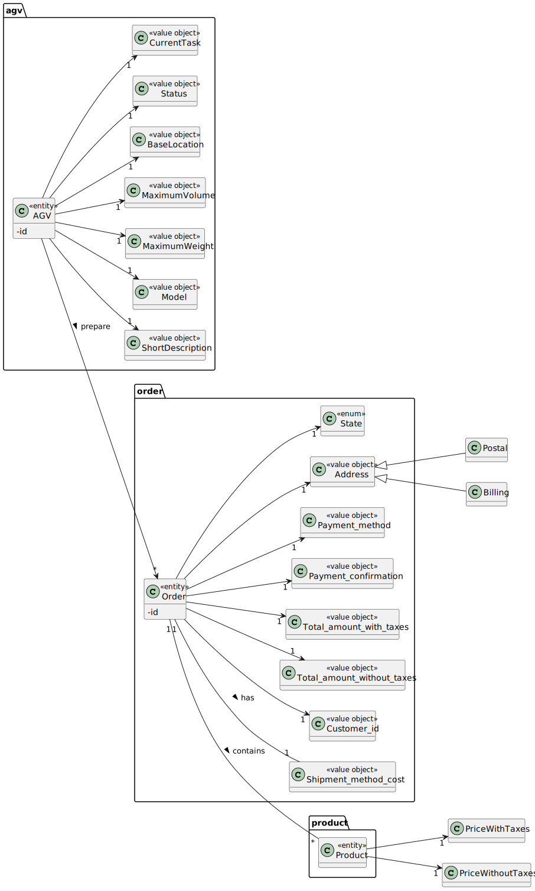
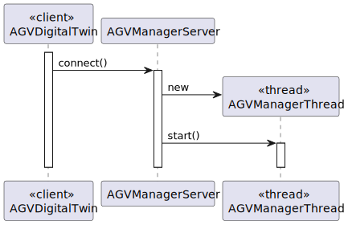
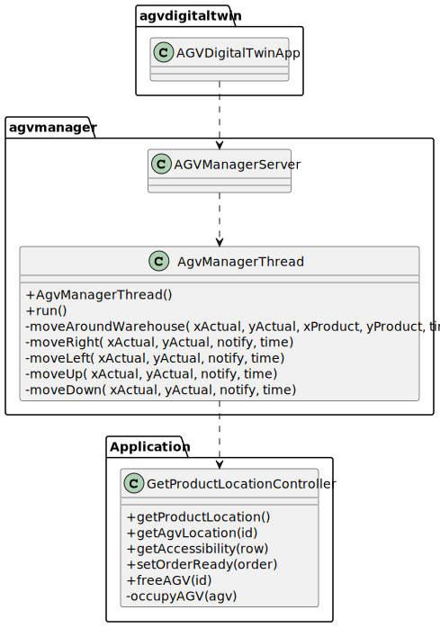

# US 4003, 5003, 5004 and 2006
## 1. Requirements Engineering

### 1.2. Customer Specifications and Clarifications

From the client clarifications:

* Question: "On the SPOMS Communications Protocol document, it says that an AGVDigitalTwin is both a server and client application. Since it communicates with the AGVManager, does it mean that the AGV Manager is both client and server as well, or should the requests to the Digital Twin be sent as server?"
    * [Answer: ](https://moodle.isep.ipp.pt/mod/forum/discuss.php?d=16959#p21734) "The AGV Manager is both: server and client. As a server, it receives requests from the "BackOffice App" and from the "Digital Twin" and, as client, it sends requests to the "Digital Twin"."

* Question: "On this question (https://moodle.isep.ipp.pt/mod/forum/discuss.php?d=16394) regarding the relationship between US2003 and 4002, you said “However, if such option is not available (e.g.: turned off) or by some reason an order needs to be prepared faster than it would normally be, the warehouse employee has the ability to assign tasks manually (US 2003)”. When you say that the option is turned off, do you mean the AGV Manager as a whole, or just the FIFO algorithm?"
    * [Answer: ](https://moodle.isep.ipp.pt/mod/forum/discuss.php?d=16959#p21734) "No! The "turned off" means that the algorithm automatically assigning tasks to AGV is not running. But, the "AGV Manager" stills running."

* Question: "In case it’s just the option that needs to be turned off, if the warehouse employee wants to force a task onto an AGV, does it need to be through the AGV Manager? And can the BackOffice application get the available AGVs directly with the database, or should it ask the AGVManager for them?"
  * [Answer: ](https://moodle.isep.ipp.pt/mod/forum/discuss.php?d=16959#p21734) "Your solution must be in conformity with figure 2 of the specifications' document."

* Question: "Also, currently, once we start the AGV Manager server, messages are constantly printed on the console, which makes the usability impossible to turn on or off the FIFO option (in case such does exist). Would you prefer having two instances of the app running, one that acts as a server and other that serves as the FIFO, that can be turned on or off?"
  * [Answer: ](https://moodle.isep.ipp.pt/mod/forum/discuss.php?d=16959#p21734) "You can turn on/off the FIFO algorithm when starting the AGVManager."

* Question: "In case that option does not exist, or the manual task assignment is not done through the AGV Manager, how should the digital twin be aware of the newly created task?"
  * [Answer: ](https://moodle.isep.ipp.pt/mod/forum/discuss.php?d=16959#p21734) "Currently, there are two options: (i) manually or (ii) automatically by the FIFO algorithm."

### 1.3. Acceptance Criteria

* It should be adopted SSL/TLS with mutual authentication based on public key certificates.

### 1.4. Found out Dependencies

### 1.5 Input and Output Data

### 1.6 Other Relevant Remarks

## 2. Analysis

### 2.1. Relevant Domain Model Excerpt

### 2.2. Other Remarks

## 3. Design - User Story Realization

### 3.1. Sequence Diagram (SD)

## 3.2. Class Diagram (CD)

## 4. Observations

The documentation for RCOMP USs (4003, 5003, 5004 and 2006) is the same because this USs uses the same classes.
These USs were simple to do because we just have to add the SSL certificates validation.
To run agv digital twin it is necessary to write two parameters, server's ip and the certificate.
The agv and the server communicate using an array of bytes where the first position is the version, the second is the request code,
for the positions corresponding to the size, we don't think it's necessary, and finally the data, in this case the agv id.
We decided to use code 4 when the agv digital twin want to prepare a order.

